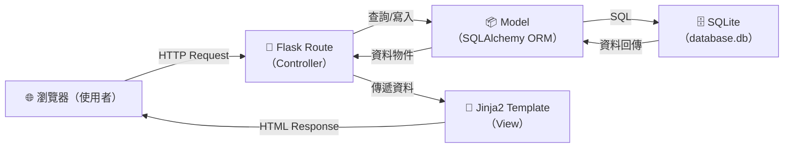
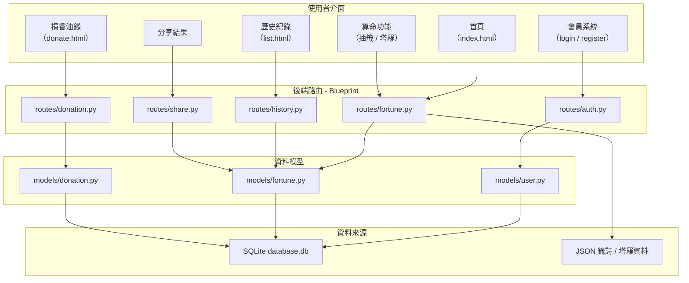

# 系統架構文件：線上算命系統

## 1. 技術架構說明

### 1.1 選用技術與原因

| 技術 | 用途 | 選用原因 |
| --- | --- | --- |
| **Python 3** | 後端程式語言 | 語法簡潔、生態豐富，適合快速開發 Web 應用 |
| **Flask** | Web 框架 | 輕量、彈性高，適合中小型專案，學習曲線低 |
| **Jinja2** | 模板引擎 | Flask 內建支援，可直接在 HTML 中嵌入 Python 邏輯，渲染動態頁面 |
| **SQLite** | 關聯式資料庫 | 無需安裝額外服務、單檔部署，適合開發與教學環境 |
| **SQLAlchemy** | ORM 工具 | 提供物件導向的資料庫操作方式，減少手寫 SQL，降低出錯風險 |
| **Flask-Login** | 會員驗證 | 處理使用者登入狀態與 Session 管理，與 Flask 深度整合 |
| **Werkzeug** | 密碼加密 | Flask 內建依賴，提供 `generate_password_hash` / `check_password_hash` 安全雜湊功能 |

### 1.2 Flask MVC 模式說明

本專案採用 **MVC（Model-View-Controller）** 架構模式，將程式碼職責清楚分離：

| 層級 | 對應位置 | 職責說明 |
| --- | --- | --- |
| **Model（模型層）** | `app/models/` | 定義資料結構與資料庫操作邏輯。每個資料表對應一個 Python 類別（如 `User`、`FortuneRecord`），負責 CRUD 操作。 |
| **View（視圖層）** | `app/templates/` | 使用 Jinja2 撰寫 HTML 模板，負責頁面的呈現與顯示邏輯。接收 Controller 傳來的資料並渲染成使用者看到的網頁。 |
| **Controller（控制層）** | `app/routes/` | Flask 路由函式，負責接收使用者的 HTTP 請求、呼叫 Model 取得或寫入資料、再將結果交給 View 渲染回傳。 |

---

## 2. 專案資料夾結構

```
web_app_development/
│
├── docs/                        ← 設計文件
│   ├── PRD.md                   ← 產品需求文件
│   └── ARCHITECTURE.md          ← 系統架構文件（本文件）
│
├── app/                         ← 應用程式主目錄
│   ├── __init__.py              ← Flask App 工廠函式，初始化 Flask、SQLAlchemy、Login 等擴充
│   │
│   ├── models/                  ← Model 層：資料庫模型定義
│   │   ├── __init__.py
│   │   ├── user.py              ← 使用者模型（帳號、密碼雜湊、建立時間）
│   │   ├── fortune.py           ← 算命結果模型（籤詩內容、占卜類型、時間戳記）
│   │   └── donation.py          ← 捐獻紀錄模型（金額、捐獻時間、付款狀態）
│   │
│   ├── routes/                  ← Controller 層：Flask 路由（Blueprint）
│   │   ├── __init__.py
│   │   ├── auth.py              ← 會員相關路由（註冊、登入、登出）
│   │   ├── fortune.py           ← 算命功能路由（抽籤、塔羅、每日運勢）
│   │   ├── history.py           ← 歷史紀錄路由（查看、管理算命結果）
│   │   ├── donation.py          ← 捐獻香油錢路由（金流處理）
│   │   └── share.py             ← 分享功能路由（產生分享連結或圖片）
│   │
│   ├── templates/               ← View 層：Jinja2 HTML 模板
│   │   ├── base.html            ← 共用版型（導覽列、頁尾、CSS/JS 引入）
│   │   ├── index.html           ← 首頁（功能入口、每日運勢看板）
│   │   ├── auth/
│   │   │   ├── login.html       ← 登入頁面
│   │   │   └── register.html    ← 註冊頁面
│   │   ├── fortune/
│   │   │   ├── draw.html        ← 抽籤頁面（含動畫效果）
│   │   │   ├── tarot.html       ← 塔羅占卜頁面
│   │   │   └── result.html      ← 算命結果展示頁面
│   │   ├── history/
│   │   │   └── list.html        ← 歷史紀錄列表頁面
│   │   └── donation/
│   │       └── donate.html      ← 捐香油錢頁面
│   │
│   ├── static/                  ← 靜態資源
│   │   ├── css/
│   │   │   └── style.css        ← 全站樣式
│   │   ├── js/
│   │   │   └── main.js          ← 前端互動邏輯（抽籤動畫、表單驗證等）
│   │   └── images/              ← 圖片素材（籤筒圖、塔羅牌圖等）
│   │
│   └── data/                    ← 靜態資料檔案
│       ├── fortune_sticks.json  ← 籤詩資料（編號、籤詩、解籤內容）
│       └── tarot_cards.json     ← 塔羅牌資料（牌名、正位/逆位解釋）
│
├── instance/                    ← Flask instance 資料夾（不進版控）
│   └── database.db              ← SQLite 資料庫檔案
│
├── app.py                       ← 應用程式入口（啟動 Flask Server）
├── config.py                    ← 組態設定（SECRET_KEY、DB 路徑、DEBUG 模式等）
├── requirements.txt             ← Python 套件相依清單
└── .gitignore                   ← Git 忽略規則
```

### 各資料夾 / 檔案用途摘要

| 路徑 | 說明 |
| --- | --- |
| `app/__init__.py` | Flask 應用程式工廠函式，集中初始化所有擴充套件並註冊 Blueprint |
| `app/models/` | 定義所有資料庫模型（ORM 類別），每個檔案對應一張資料表 |
| `app/routes/` | 定義所有 URL 路由，按功能模組分檔，使用 Flask Blueprint 組織 |
| `app/templates/` | 所有 HTML 頁面模板，使用 Jinja2 繼承 `base.html` 共用版型 |
| `app/static/` | CSS、JavaScript、圖片等靜態檔案，由 Flask 直接提供 |
| `app/data/` | 籤詩、塔羅牌等固定內容，以 JSON 格式儲存，方便維護與擴充 |
| `instance/` | SQLite 資料庫存放位置，不納入版本控制 |
| `config.py` | 集中管理所有組態設定（如密鑰、資料庫路徑、開發/正式環境切換） |

---

## 3. 元件關係圖

### 3.1 系統元件互動流程



### 3.2 功能模組關係圖



---

## 4. 關鍵設計決策

### 決策 1：使用 Flask Blueprint 模組化路由

**決定**：將路由按功能分檔（auth、fortune、history、donation、share），使用 Flask Blueprint 註冊。

**原因**：
- 避免所有路由擠在同一個檔案，提升可讀性與可維護性。
- 團隊成員可以各自負責不同的 Blueprint，降低合併衝突。
- 日後新增功能只需新增一個 Blueprint 檔案，不影響現有程式碼。

### 決策 2：籤詩與塔羅資料使用 JSON 檔案而非資料庫

**決定**：將籤詩內容與塔羅牌解釋存放在 `app/data/` 下的 JSON 檔案中。

**原因**：
- 這些資料是「靜態內容」，不會因使用者操作而改變，不需要 CRUD 操作。
- JSON 格式容易閱讀與編輯，非工程人員也能協助維護內容。
- 程式啟動時一次載入記憶體，比每次查詢資料庫更快。

### 決策 3：使用 Flask-Login 管理會員狀態

**決定**：採用 Flask-Login 擴充套件處理登入驗證與 Session 管理。

**原因**：
- Flask-Login 提供成熟的 `@login_required` 裝飾器，可輕鬆保護需要登入才能存取的頁面（如歷史紀錄、捐獻）。
- 內建 Session 管理與「記住我」功能，減少自行實作的工作量與安全風險。

### 決策 4：捐獻功能先以模擬方式實作

**決定**：MVP 階段的捐香油錢功能先不串接真實金流 API，改用模擬付款（虛擬扣款按鈕 + 紀錄寫入資料庫）。

**原因**：
- 串接真實金流（如綠界）需要商店帳號、SSL 憑證與複雜的回調驗證，不適合 MVP 階段。
- 先專注於前後端流程的完整性，確認 UI/UX 與資料寫入邏輯正確後，再替換為真實金流。
- 資料模型（`Donation`）已預留付款狀態欄位，未來串接時只需修改 Controller，不影響 Model 與 View。

### 決策 5：使用 Jinja2 模板繼承共用版型

**決定**：建立 `base.html` 作為全站共用版型，所有頁面透過 `` 繼承。

**原因**：
- 導覽列、頁尾、CSS/JS 引入只需維護一處，避免重複程式碼。
- 各頁面只需專注於自己的內容區塊（``），開發效率高。
- 日後調整全站風格或新增共用元素時，只需修改 `base.html` 一個檔案。
