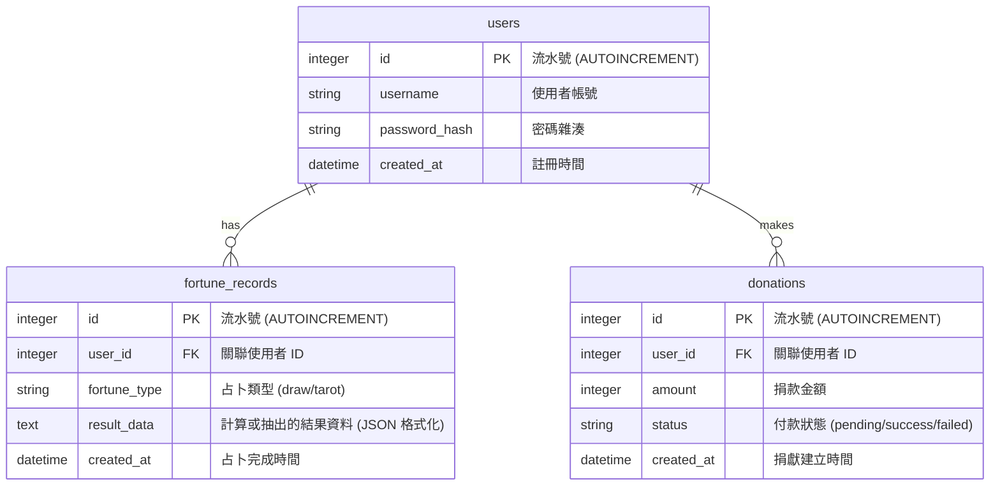

# 資料庫設計文件：線上算命系統

## 1. ER 圖（實體關係圖）

## 2. 資料表詳細說明

### 2.1 `users` 資料表 (使用者)
負責儲存使用者的登入資訊。密碼以雜湊格式儲存，並作為各紀錄的主人。
- `id` (INTEGER): Primary Key，自動遞增。
- `username` (VARCHAR(50)): 帳號名稱，不重複 (Unique)、必填。
- `password_hash` (VARCHAR(255)): 通過 bcrypt/Werkzeug 轉換加密後的密碼，必填。
- `created_at` (DATETIME): 帳號建立紀錄時間，預設為當下時間。

### 2.2 `fortune_records` 資料表 (算命紀錄)
紀錄使用者每一次的操作結果，支援不同類型的算命。
- `id` (INTEGER): Primary Key，自動遞增。
- `user_id` (INTEGER): Foreign Key，對應到 `users` 表的 `id`，必填。
- `fortune_type` (VARCHAR(20)): 指出紀錄類型如線上抽籤 (`draw`) 或是塔羅牌 (`tarot`)，必填。
- `result_data` (TEXT): 長文字類型，可容納 JSON 格式。儲存抽出的籤詩編號，或是牌陣的順序與結果，必填。
- `created_at` (DATETIME): 完成該次占卜系統當下給予紀錄的時間。

### 2.3 `donations` 資料表 (捐獻紀錄)
線上追蹤每一筆香油錢的狀態、款項等資訊。
- `id` (INTEGER): Primary Key，自動遞增。
- `user_id` (INTEGER): Foreign Key，對應到 `users` 表的 `id`，必填。
- `amount` (INTEGER): 捐獻數量，整數，必填。
- `status` (VARCHAR(20)): 目前款項狀態，如：`pending` (等待付款)、`success` (付款成功)、`failed` (失敗)，預設為 `pending`。
- `created_at` (DATETIME): 捐獻訂單建立的時間。
