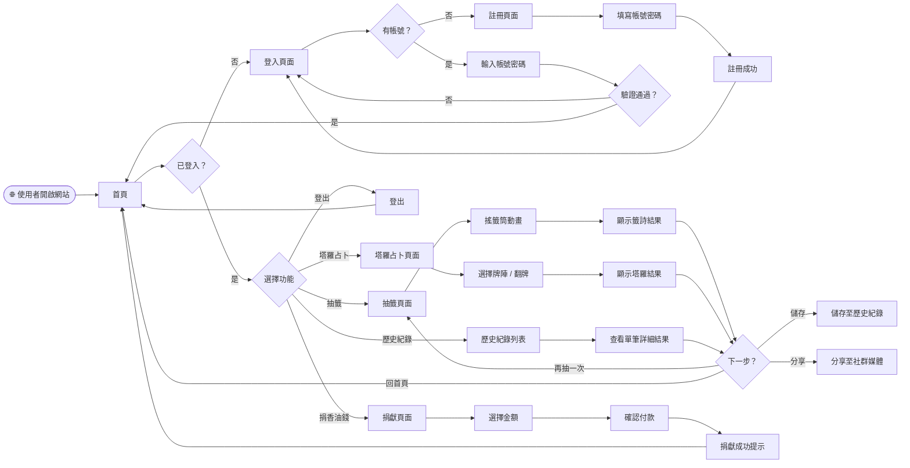
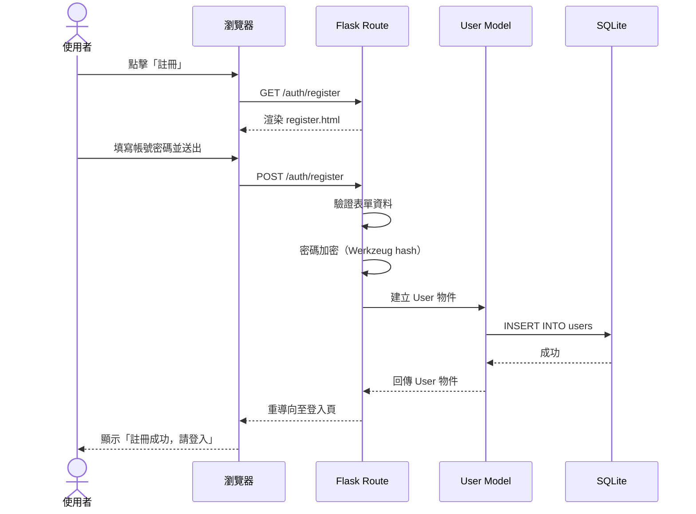
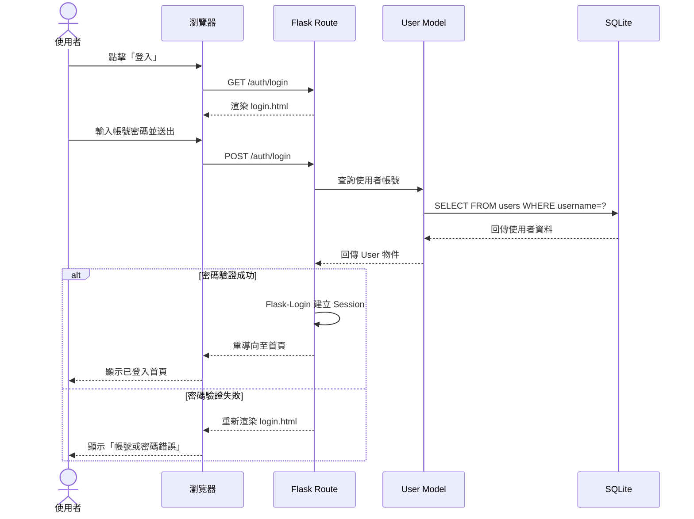
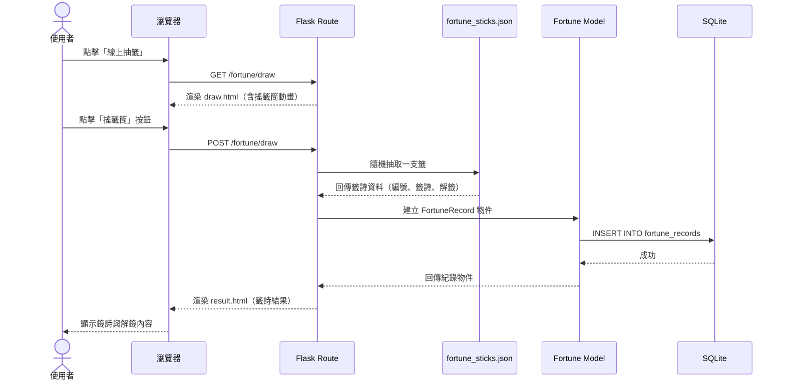
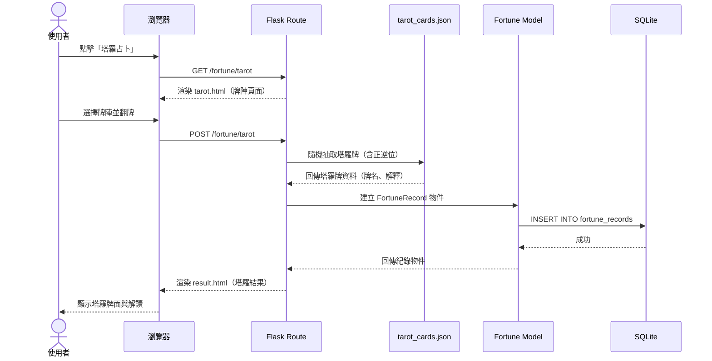
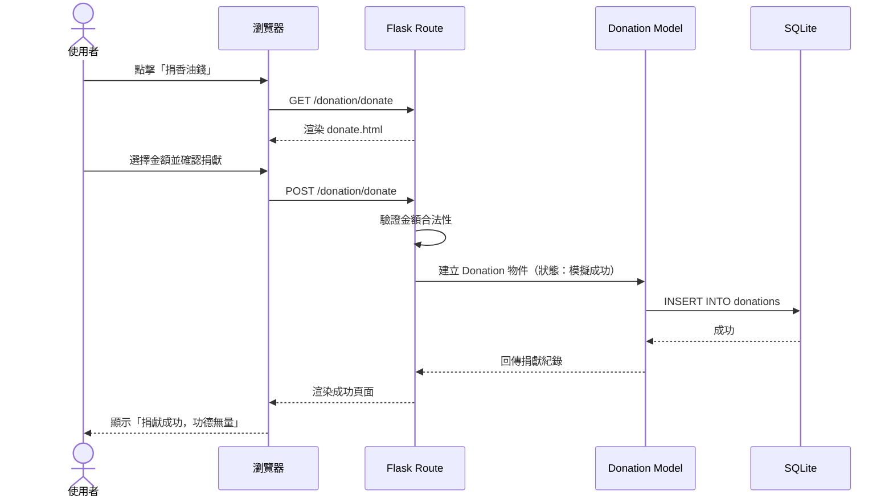
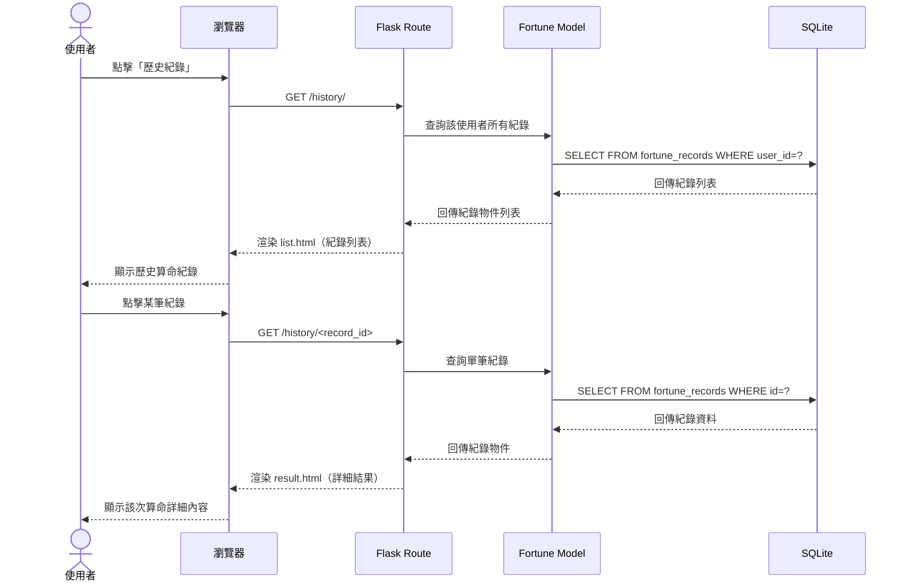

# 流程圖文件：線上算命系統

## 1. 使用者流程圖（User Flow）

以下流程圖描述使用者從進入網站開始，到完成各項功能的完整操作路徑。

### 流程說明

- **進入網站**：使用者開啟網站後會進入首頁，系統判斷是否已登入。
- **未登入**：需先註冊或登入，才能使用算命功能與歷史紀錄。
- **已登入**：可自由選擇抽籤、塔羅占卜、查看歷史紀錄、捐香油錢等功能。
- **算命結果**：每次算命完成後，使用者可選擇儲存、分享、再試一次或返回首頁。

---

## 2. 系統序列圖（Sequence Diagram）

### 2.1 會員註冊流程

### 2.2 會員登入流程

### 2.3 線上抽籤流程

### 2.4 塔羅占卜流程

### 2.5 捐香油錢流程

### 2.6 查看歷史紀錄流程

---

## 3. 功能清單對照表

| 功能 | URL 路徑 | HTTP 方法 | 說明 |
| --- | --- | --- | --- |
| 首頁 | `/` | GET | 顯示首頁，含功能入口與每日運勢 |
| 註冊頁面 | `/auth/register` | GET | 顯示註冊表單 |
| 註冊處理 | `/auth/register` | POST | 處理註冊資料，建立帳號 |
| 登入頁面 | `/auth/login` | GET | 顯示登入表單 |
| 登入處理 | `/auth/login` | POST | 驗證帳密，建立登入 Session |
| 登出 | `/auth/logout` | GET | 清除 Session，登出使用者 |
| 抽籤頁面 | `/fortune/draw` | GET | 顯示搖籤筒頁面 |
| 抽籤處理 | `/fortune/draw` | POST | 隨機抽籤，儲存結果並顯示 |
| 塔羅占卜頁面 | `/fortune/tarot` | GET | 顯示塔羅牌陣頁面 |
| 塔羅占卜處理 | `/fortune/tarot` | POST | 隨機抽牌，儲存結果並顯示 |
| 算命結果頁面 | `/fortune/result/<id>` | GET | 顯示單次算命的詳細結果 |
| 歷史紀錄列表 | `/history/` | GET | 顯示使用者所有算命紀錄 |
| 歷史紀錄詳情 | `/history/<id>` | GET | 顯示單筆歷史紀錄詳細內容 |
| 捐獻頁面 | `/donation/donate` | GET | 顯示捐香油錢頁面 |
| 捐獻處理 | `/donation/donate` | POST | 處理捐獻，寫入紀錄 |
| 分享結果 | `/share/<id>` | GET | 產生可分享的算命結果頁面 / 連結 |
